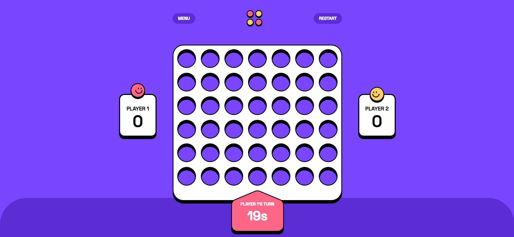
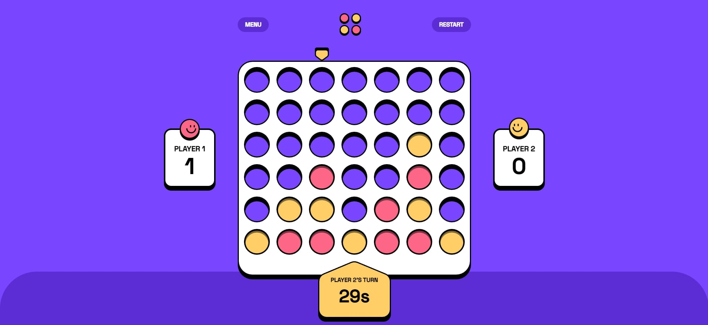
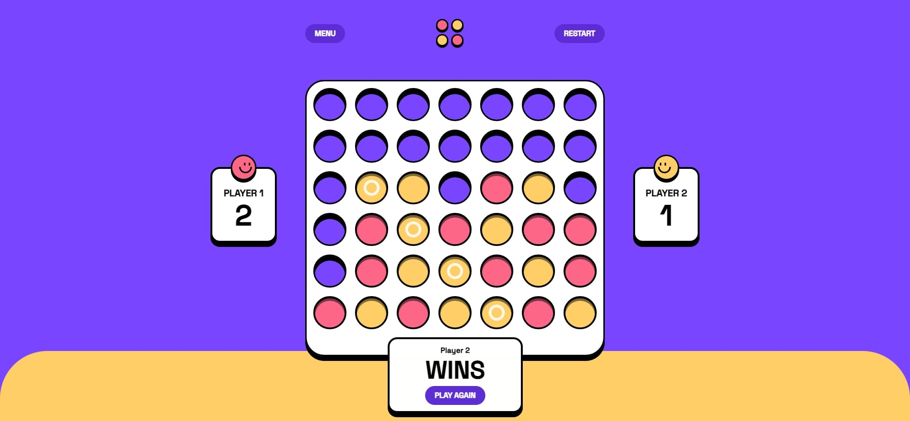
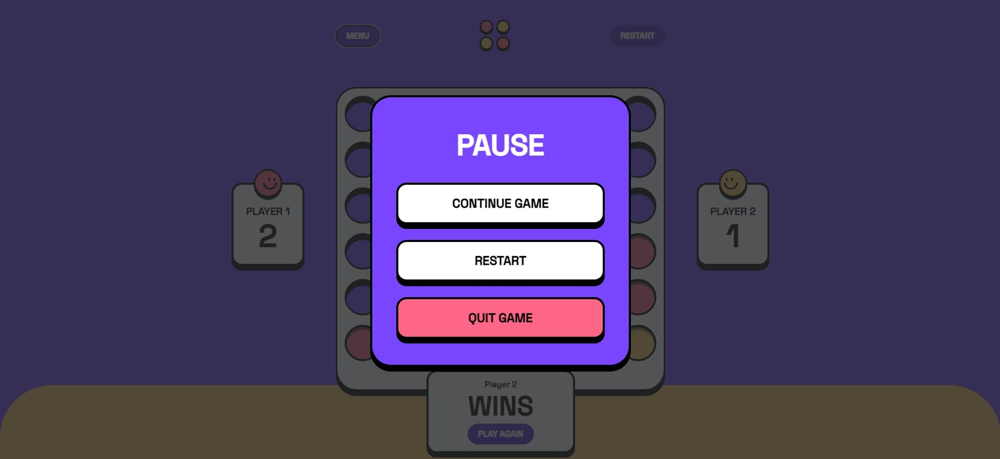
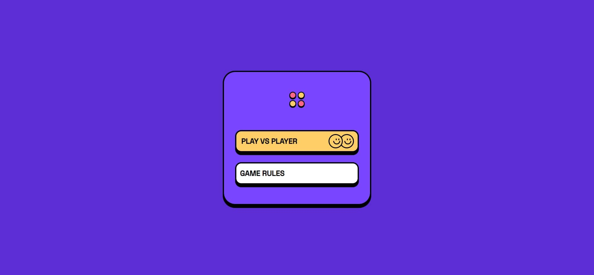
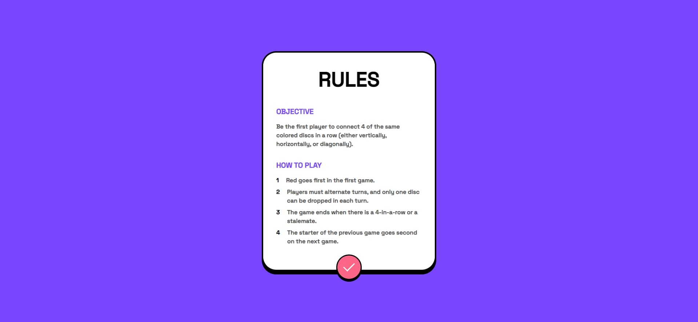
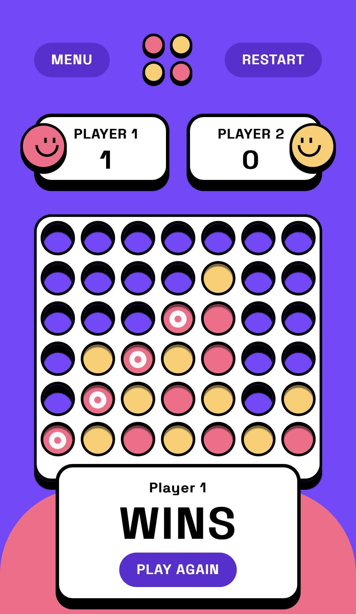
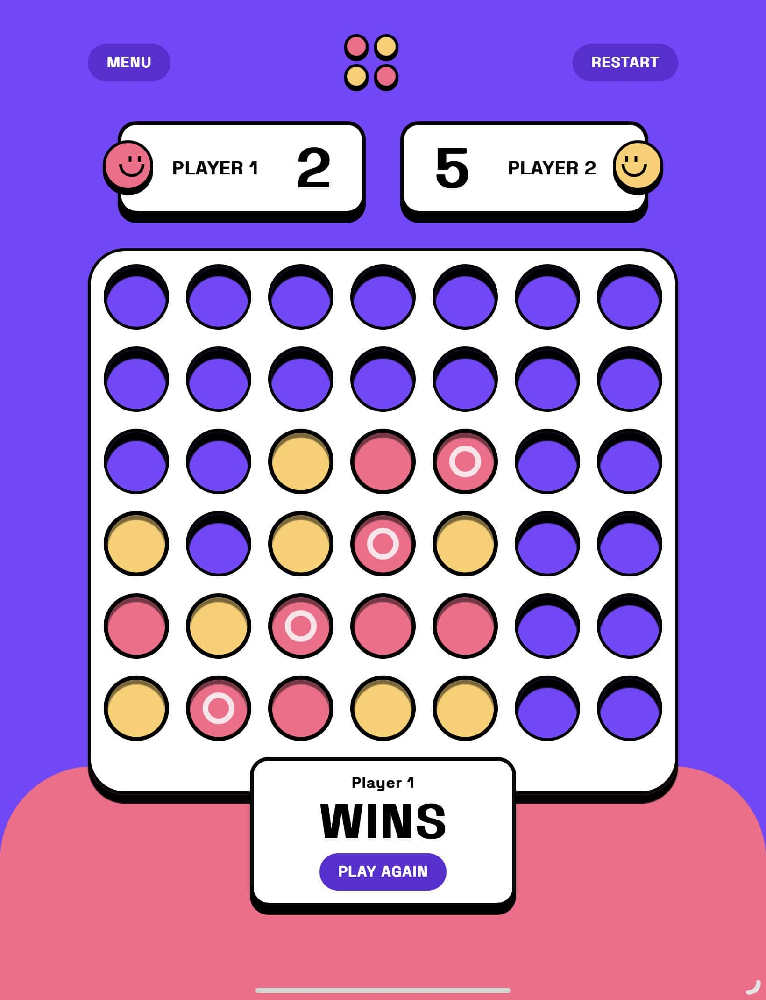

# Table of contents

- [Overview](#overview)
  - [The challenge](#the-challenge)
  - [Screenshot](#screenshot)
  - [Links](#links)
- [My process](#my-process)
  - [Built with](#built-with)
  - [What I learned](#what-i-learned)
  - [Continued development](#continued-development)
  - [Useful resources](#useful-resources)
- [Author](#author)
- [Acknowledgments](#acknowledgments)

## Overview

### The challenge

Users should be able to:

- View the game rules
- Play a game of Connect Four against another human player (alternating turns on the same computer)
- View the optimal layout for the interface depending on their device's screen size
- See hover and focus states for all interactive elements on the page
- See the discs animate into their position when a move is made

### Screenshot

### Links

- Live Site URL: [Link](https://lehoanghai9.github.io/connectfour/)

## My process

The process of implementing the game board involved a lot of experimentation and trial and error. Initially, I tried using a matrix to store the game state, but found that it was more difficult for me to manipulate and realised I am more comfortable with modular arithmetic.

To allow the player to place a disk in a column, I used event listeners to track the cell that the mouse was hovering over and, on click, placed the disk in the bottom available cell in that column. This required careful attention to detail to ensure that the disk was placed in the correct position and that the game state was updated accordingly.

Animating the falling disks was another challenge, as I had to ensure that the animation played smoothly and that the disk landed in the correct position. I used CSS animations and transitions to create a smooth, visually appealing effect.

The process of checking for a winner involved tracking the position of the most recently placed disk and then searching for four consecutive disks of the same color in the rows, columns, and diagonals below that position. This required careful consideration of the game state and a thorough understanding of how to manipulate arrays.

Using a Figma file as a reference was incredibly helpful in creating a visually appealing design for the game. It allowed me to experiment with different colors and styles before implementing them in the code. Overall, the process of implementing this game involved a lot of problem-solving and creativity, but was ultimately very rewarding.

### Built with

- React
- Tailwind CSS

### What I learned

This is my second React project, but the first one that was functionally heavy. Learned a lot about how to use and manipulate different React elements and components. Started learning programming a month ago, so there was definitely a steep learning curve, but it was exciting to see the progress I made with each step. One of the biggest challenges was figuring out how to efficiently update the game state and re-render the board after each move. I also had to learn how to incorporate animations into the game, which was a new and interesting experience.

This project was a great opportunity for me to gain more experience with React and improve my programming skills. It also helped me understand the importance of breaking down a problem into smaller, manageable tasks and utilizing external resources like documentation and videos to help guide the process. With each project, I feel more confident in my abilities and look forward to tackling more complex challenges in the future.

All in all, this was a fun 3 days project.

## Author

- Frontend Mentor - [@lehoangha9](https://www.frontendmentor.io/profile/lehoanghai9)

